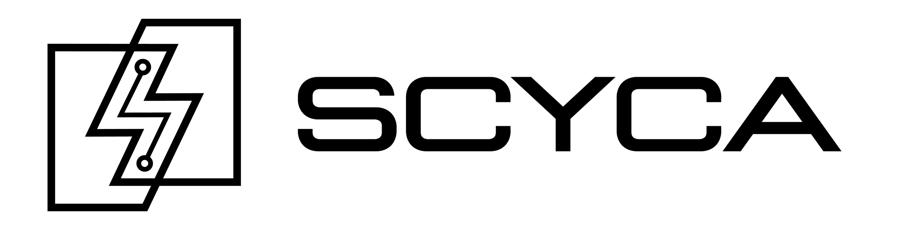

# FBC-2022-Spring-CTF
Capture The Flag (CTF) competition prepared for Fallbrook Cyber, Spring 2022



## Welcome!!
This CTF is compromised of 30 challenges, with 6 problems per each of the 5 sections. For the newer players out there this is referring to the standard 5 CTF sections: web exploitation (webex), binary exploitation (binex), forensics, networking, and cryptography (crypto). The problems increase in difficulty as you progress through the point ratings with harder or more intricate problems awarding more points. Each problem has a series of hints that will get you 90% of the way to the answer if you choose to use them. The competition organizers have decided to leave these hints free for your use as the root purpose is of course to teach the skills and techniques to you. Each challenge will still, however, require a fair bit of effort from the participant to solve.

Competition opens at 1500, at the start of the first practice of the year, 7 January 2022 and runs until the start of our last practice of the season on 20 May 2022. The goal is for you as the participant to take as much as possible away from this, aside from just the cool prizes ;)

## Prize Pool
These prizes are set for each position, however, prizes are actually picked in the order of the winner. For example, if the first place winner wants to take the second place prize and give up the first place prize to the would be winner, that is perfectly acceptable. Aside from placement prizes, the completion prizes are not limited to a single individual. In order to qualify for the 100 point prize, you must have not only the points, but all 10 points problems complete.

**1st Place** - Pick set and demo locks<br>
**2nd Place** - Raspberry Pi 4B<br>
**3rd Place** - Arduino w/BB Kit<br>

**150 points** - HTB 1 Month Voucher
**1000 points** - THM 3 Month Voucher

**Tie breaks:** If there is a tie for a position on the scoreboard based on total points the tie will be broken by who achieved that amount of points first.
<br>

# Challenges
| Pts | [Web Exploitation](#web-exploitation-webex) | [Binary Exploitation](#binary-exploitation-binex) | [Cryptography](#cryptography-crypto) | [Networking](#networking) | [RE & Forensics](#Reversing-and-Forensics) |
|:----:|:----------------:|:------------------:|:--------------:|:----------------:|:-----------------:|
|  10  | Inspector Gadget | Execution          | Titanic        | Shark Week      | The Strings        |
|  25  | The Middleman    | Telegram           | Cleopatra      | The Matrix      | Arrival            |
|  50  | Get Out          | Fast and Furious   | Da Vinci Code  | Parasite        | Hidden Figures     |
|  50  | Mr. Robot        | Stacked            | Imitation Game | Polaroid        | Hidden Places      |
|  50  | Cookie Monster   | Ready, Aim, Fire   | Codebreaker    | Spy Kids        | Eraser             |
|  90  | The Postman      | Return of the King | Enigma         | You've Got Mail | Mission Impossible |

<br>

# Build on your System
Initialize docker with: ```sudo docker-compose up -d```
Rebuild containers and init with: ```sudo docker-compose up --rebuild -d```
Stop all instances with: ```sudo docker-compose stop```

## Mappings
- fast-and-furious (1234:1234/tcp)
- meme-gallery:(1337:1337/tcp)
- mail (3000:3000/tcp --and-- 5000-5500:5000-5500/udp)
- telegram (5555:5555/tcp)
- stack-abuser(6000:6000/tcp)
- robotics (7777:7777/tcp)
- portal (9001:9001/tcp)

<br>

## Getting Started
### WELCOME [1pt] For the Flag
[**Solution:**](solutions/welcome/for_the_flag) ```solutions/welcome/for_the_flag```
> FBC{have_you_got_what_it_takes?}

**Intended Solution:** Simply read the instructions and after creating an account get on the board with a single point. This gets the engine to recognize their account and gets them familiar.

**Teaching Points:** This is how all Jeapordy CTFs work and its going to get them used to our flag format so that they have a crib in some cases or just so they know what they're looking for.

<br>

## Web Exploitation (WEBEX)
### WEBEX [10pts] Inspector Gadget
[**Challenge:**](challenges/tcp1337-webapp-nodejs) ```challenges/tcp1337-webapp-nodejs```<br>
[**Solution:**](solutions/web/inspector_gadget) ```solutions/web/inspector_gadget```
> FBC{looks_like_you're_a_real_detective}

**Intended Solution:** The competitor navigates to the web page (with off-nominal port) and uses "inspect element" or "view source" to observe the HTML and code comments, where the flag is embedded.

**Teaching Points:** Web servers dont have to run on the standard port 80 and we can access them by specify the port explicitly. Additionally, the HTML that the browser is displaying might have notable secrets.

### WEBEX [25pts] The Middleman
[**Challenge:**](challenges/tcp1337-webapp-nodejs) ```challenges/tcp1337-webapp-nodejs```<br>
[**Solution:**](solutions/web/the_middleman) ```solutions/web/the_middleman```
> FBC{use_your_head_check_out_the_headers}

**Intended Solution:** The competitor sets up a web proxy, ideally BurpSuite Community and using that web proxy intercepts web requests between the client browser and web server. The flag is in a XFLAG header.

**Teaching Points** Here we introudce the idea of a web proxy and the concept that browers and servers are simply operating in a client-server relationship.

### WEBEX [50pts] Get Out
[**Challenge:**](challenges/tcp7777-webapp-nodejs) ```challenges/tcp7777-webapp-nodejs```<br>
[**Solution:**](solutions/web/get_out) ```solutions/web/get_out```
> FBC{GETm_outta_here}

**Intended Solution:** After navigating around the page and inspecting that the hyperlinks simply change a GET parameter, the user finds a code comment TODO saying that the "flag" button hasnt been implemented yet. They forecfully submit "flag" as the GET param to display the flag image.

**Teaching Points:** GET requests power the internet; the primary teaching point is what a GET request is and how parameter data is passed from the client to server. Additionally, how it can be manipulated.

### WEBEX [50pts] Mr. Robot
[**Challenge:**](challenges/tcp7777-webapp-nodejs) ```challenges/tcp7777-webapp-nodejs```<br>
[**Solution:**](solutions/web/mr_robot) ```solutions/web/mr_robot```
> FBC{why_do_we_want_to_stop_spiders_anyways?}

**Intended Solution:** User performs standard webapp reconisance and identifies an active robots.txt page. This page has an admin page that should be behind auth but is accessible. The user forecfully browses to the page for the flag.

**Teaching Points:** First and foremost we teach what the robots RFC is and why its implemented for spiders. Then there is the idea that sometimes its used to hiden sensitive pages and can therefore expose them. Lastly, foreful browsing.

### WEBEX [50pts] The Postman
[**Challenge:**](challenges/tcp9001-webapp-nodejs) ```challenges/tcp9001-webapp-nodejs```<br>
[**Solution:**](solutions/web/the_postman) ```solutions/web/the_postman```
> FBC{ill_get_to_it_when_i_get_to_it}

**Intended Solution:** First the user identifies that the button is disabled for login and goes to inspect source. When they do they find the code comment telling them to manually POST the provided credentials. This response contains the flag.

**Teaching Points:** First and foremost this challenge teaches about POST parameters and how login interactions often work. More importantly it teaches how to execute a POST request manually and observe the response.

### WEBEX [90pts] Cookie Monster
[**Challenge:**](challenges/tcp9001-webapp-nodejs) ```challenges/tcp9001-webapp-nodejs```<br>
[**Solution:**](solutions/web/cookie_monster) ```solutions/web/cookie_monster```
> FBC{gimme_that_real_john_hancock}

**Intended Solution:** Continuing The Postman the user is redirected to admin.html and provided a JWT. This JWT contains a boolean admin field which can be modified. The token signature is not validated. With this change the admin can access admin.html for the flag.

**Teaching Points:** What is a JWT? How is it used? Why is the signature important? This also teaches how a brower stores data, cookies, and how users can maniuplate them to their advantage.

<br>

## Binary Exploitation (BINEX)
### BINEX [10pts] Execution
[**Challenge:**](challenges/binary01-ELFx86) ```challenges/binary01-ELFx86```<br>
[**Solution:**](solutions/binex/execution) ```solutions/binex/execution```
> FBC{WaIt_bUt_ThAtS_nOt_An_ExE}

**Intended Solution:** The competitor will recieve the binary and must run it in order to recieve the flag, this means downloading it to an approperiate directory and setting executable, then running it.

**Teaching Points:** Here we are teaching that a binary will always be downloaded as 600 perms and needs to get executable perms in order to execute. Also loosely that anything can be set executable. Basically just how to run executables on a linux machine.

### BINEX [25pts] Telegram
[**Challenge:**](challenges/tcp5555-socket-ynetd) ```challenges/tcp5555-socket-ynetd```<br>
[**Solution:**](solutions/binex/telegram) ```solutions/binex/telegram```
> FBC{the_world_runs_on_sockets}

**Intended Solution:** Here the competitor connects to a socket and must recieve a message. This is intended to be done with netcat but could teheoritically be done with pwntools or raw socket programming in any language.

**Teaching Points:** This is designed to be a ramp up to sending and recieving an actual exploit across a socket remotely. The idea being that we first teach basic socket programming, then stack on top of it with pwntools.

### BINEX [50pts] Fast and Furious
[**Challenge:**](challenges/tcp1234-socket-ynetd) ```challenges/tcp1234-socket-ynetd```<br>
[**Solution:**](solutions/binex/fast_and_furious) ```solutions/binex/fast_and_furious```
> FBC{faster_and_more_furious}

**Intended Solution:** The competitor starts from a similar place with generic socket programming, but now must script in order to both send AND recieve from the socket 100 times within 10 seconds. This has to be scripted due to the time requirement.

**Teaching Points:** Here we continue to staack on top of the socket programming concepts. The goal is to get a student to be able to recieve a program prompt or arbitrary data and handle that before sending a payload.

### BINEX [50pts] Stacked
[**Challenge:**](challenges/tcp6000-socket-ynetd) ```challenges/tcp6000-socket-ynetd```<br>
[**Solution:**](solutions/binex/stacked) ```solutions/binex/stacked```
> FBC{WOAH_you_shouldnt_be_able_to_overwrite_THAT}

**Intended Solution:** Now the competitor has a variable loaded onto the stack and must overwrite the contents via overflow. When that happens on the remote machine logic checks determine the variable was overflowed and print a value to the screen.

**Teaching Points:** We continue to build towards a stack overflow exploit for the purpose of RCE, here introducing the overwriting of variables on the stack. The user will get the source code here so they can undrstand whats going on behind the scenes a bit.

### BINEX [50pts] Ready, Aim, Fire
[**Challenge:**](challenges/tcp6000-socket-ynetd) ```challenges/tcp6000-socket-ynetd```<br>
[**Solution:**](solutions/binex/ready_aim_fire) ```solutions/binex/ready_aim_fire```
> FBC{fire_and_forget}

**Intended Solution:** Now the competitor must calculate at exactly what offset the overflow is happening and replace those specific bytes with a non-printable byte pattern. This means pattern creation and matching.

**Teaching Points:** Continuing to build on the overflow logic, here we are introducing the idea of calculating where you have control. Offset calculation is critical to obtaining eventual code execution and this is the final step prior to overwriting with real addresses.

### BINEX [90pts] Return of the King
[**Challenge:**](challenges/tcp6000-socket-ynetd) ```challenges/tcp6000-socket-ynetd```<br>
[**Solution:**](solutions/binex/return_of_the_king) ```solutions/binex/return_of_the_king```
> FBC{go_google_ret2win}

**Intended Solution:** In the final binex challenge, we are overwriting with an actual address for simluated code execution. Here the user now must use the obtained shell to cat the flag file.

**Teaching Points:** Finally we get to an actual logical overwrite where the user must take their point of control and derive a shell. They do not need to write shellcode however, as this will be a ret2win style POC.

<br>

## Cryptography (CRYPTO)
### CRYPTO [10pts] Titanic
[**Challenge:**](challenges/cipher1-ascii) ```challenges/cipher1-ascii```<br>
[**Solution:**](solutions/crypto/titanic) ```solutions/crypto/titanic```
> THEY_DEFINITELY_SAID_THIS_SHIP_CAN'T_SINK

**Intended Solution:** The student starts off with a repeating pattern of dots and dashes. They google for what that pattern could be and quickly identify that it is morse code. They then use a morse decoder to retrieve the plaintext.

**Teaching Points:** Most importantly, the student learns that there is ciphertext and plaintext and that we can often convert between them using an algorithm. We start to introduce the idea that ciphers can be recognized based on patterns of characters.

### CRYPTO [25pts] Cleopatra
[**Challenge:**](challenges/cipher2-ascii) ```challenges/cipher2-ascii```<br>
[**Solution:**](solutions/crypto/cleopatra) ```solutions/crypto/cleopatra```
> FBC{looks_even_more_like_a_FLAG_now_doesn't_it}

**Intended Solution:** Student identifies that the provided text already almost looks like a flag with FBC{.*}. Then determines that everything is alphanumeric, starts looking up common ciphers and trys ceaser brute force which works.

**Teaching Points:** Here we build on top of the idea of plaintext to ciphertext conversion and introduce the idea of a key applying to the transaction. Ceaser is a great cipher for this because they key space is tiny but it requires some lateral thinking. This is why we dont just use rot13.

### CRYPTO [50pts] Da Vinci Code
[**Challenge:**](challenges/cipher3-ascii) ```challenges/cipher3-ascii```<br>
[**Solution:**](solutions/crypto/da_vinci) ```solutions/crypto/da_vinci```
> FBC{xor_is_the_backbone_of_modern_cryptography}

**Intended Solution:** Challenge description provides enough to get that there is some sort of byte for byte operation required, this gets a googlable result for XOR. Key is also provided so this is a big hint. Student uses cyberchef to decrypt.

**Teaching Points:** Continuing to build, we now have a cipher with a nonprintable key. This introduces the idea of a real key at a very low level and increases the key space from the previous problem a bit so its less "guessable. XORs are used in almost all modern ciphers so this is real world.

### CRYPTO [50pts] Imitation Game
[**Challenge:**](challenges/cipher4-ascii) ```challenges/cipher4-ascii```<br>
[**Solution:**](solutions/crypto/imitation_game) ```solutions/crypto/imitation_game```
> HOWS_YOUR_PATTERN_RECOGNITION_NOW?

**Intended Solution:** First sees a pattern ending in double equal sign and google tells them this is base64. When they decode this, it clearly becomes morse, which finally clearly becomes rot13. Cyberchef for all operations. Base64 -> Morse -> Rot13

**Teaching Points:** This problem is designed to enforce pattern recognition and introduce the idea that sometimes the plantext has been maniupulated multiple times.

### CRYPTO [50pts] Codebreaker
[**Challenge:**](challenges/cipher5-ascii) ```challenges/cipher5-ascii```<br>
[**Solution:**](solutions/crypto/codebreaker) ```solutions/crypto/codebreaker```
> FBC{why_not_try_them_all?}

**Intended Solution:** Now that the user knows how to XOR with an known single-byte key they need to brute force for a single byte in order to do the same thing. This can be done with cyberchef or with python.

**Teaching Points:** This forces the competitor to realize that the key space is small and they can simply try every option, but enforces that they must understand how to send or at least work-with non-printable characters.

### CRYPTO [90pts] Enigma
[**Challenge:**](challenges/cipher6-ascii) ```challenges/cipher6-ascii```<br>
[**Solution:**](solutions/crypto/enigma) ```solutions/crypto/enigma```
> FBC{known_plaintext?_crib_your_way_to_victory}

**Intended Solution:** Here the keyspace is 4 million-ish and while this would technically work, its much more efficient to crib a byte at a time. The idea is that they will brute force a byte at a time, saving the "solved" byte and continue to crib for the flag header. This reduces the total checks to 256*4 rather than 256^4.

**Teaching Points:** Here we introduce longer keys but talk about an actual real-world cryptographic weakness. If we have a known-plaintext and a short repeated key, we can simply crib for the plaintext as we interate through a smaller keyspace, slowly determining the key. This is borderline real-world and much easier than it sounds.

<br>

## Networking
### NET [10pts] Shark Week
[**Challenge:**](challenges/pcapng01-ip) ```challenges/pcapng01-ip```<br>
[**Solution:**](solutions/networking/shark_week) ```solutions/networking/shark_week```
> FBC{2022-01-04 12:45:03}

**Intended Solution:** First things first, the competitor simply opens the capture in wireshark and oveserves the statistics. The flag is simply the capture time of the first packet.

**Teaching Points:** Here we start to get comfortable with wireshark and specifically how to identify basic information about the capture. This serves future problems as well as general knowledge.


### NET [25pts] The Matrix
[**Solution:**](solutions/networking/the_matrix) ```solutions/networking/the_matrix```
> FBC{16_4094}

**Intended Solution:** Here the competitor must determine the number of subnets and hosts in a particular network, in this case /20. This can be done by hand but is intended to be done with a subnet calculator. With 20 subnet bits turned on there are 16 available subnets with 4094 host addresses per subnet. Flag is submitted as {subnets_hosts}

**Teaching Points:** The idea of this problem is to demonstrat what a bit is actually for. But it also introduces the idea of subnets and segregation. Its a little loose honestly, but this hopefully feels related to the networking classes.

#### NET [50pts] Parasite
[**Challenge:**](challenges/pcapng01-ip) ```challenges/pcapng01-ip```<br>
[**Solution:**](solutions/networking/parasite) ```solutions/networking/parasite```
> FBC{break_out_the_phonebook_billy}

**Intended Solution:** Here the user must investigate DNS lookups and see all the resolved hosts. The flag will simply be one of the resolved hostname lookups.

**Teaching Points:** We continue to introduce the idea of finding more data in a packet capture. Now we discuss the real-world concept of DNS lookups by either malware or clients to determine whats going on in a capture. This is essentially an introduction to DNS.

#### NET [50pts] Polaroid
[**Challenge:**](challenges/pcapng01-ip) ```challenges/pcapng01-ip```<br>
[**Solution:**](solutions/networking/polaroid) ```solutions/networking/polaroid```
> FBC{meme_extraction_is_the_real_art}

**Intended Solution:** The user must use wiresharks object dump feature to grab images out of all http connections. The flag is one of these images. We provide the stream number, so the user can focus simply on the extraction.

**Teaching Points:** Here we continue to introduce the idea of dumping data out of connections. We start with HTTP and simply show that the images that webpages are loading can be extracted from the packet capture and saved for forensic purposes.

### NET [50pts] Spy Kids
[**Challenge:**](challenges/pcapng01-ip) ```challenges/pcapng01-ip```<br>
[**Solution:**](solutions/networking/spy_kids) ```solutions/networking/spy_kids```
> FBC{kinda_secure_shell}

**Intended Solution:** Here we introduce stream investigation. Once the competitor identiifes that there is telnet traffic, they must follow-tcp-stream against the telnet connection to see the plaintext flag.

**Teaching Points:** Here we introduce follow-tcp-stream, the idea that telnet is insecure and "here's why" and lastly how to pull plaintext flags off plaintext connection captures.

### NET [90pts] You've Got Mail
[**Challenge:**](challenges/tcp3000-udp10k-11k-socket-python3) ```challenges/udp1234-udp10k-11k-socket-python3```<br>
[**Solution:**](solutions/networking/youve_got_mail) ```solutions/networking/youve_got_mail```
> FBC{fire_and_forget}

**Intended Solution:** The user starts by interacting with a UDP socket in the server and once it asks for the data the server sends the data to the user on a random port between 10-11k. The user must use wireshark to find and read the UDP stream for the flag.

**Teaching Points:** Now we introuce UDP. This challenge further gets the student to associate connections with other connections and dig further into what a specific endpoint is doing based on a specific starting point. Also, the main reason this is a 90 point problem is that they will need to foward ports 50000-55000 in order to allow the challenge through NAT. Most likely...

<br>

## Reversing and Forensics
### REVERSE [10pts] The Strings
[**Challenge:**](challenges/binary02-data) ```challenges/binary02-data```<br>
[**Solution:**](solutions/re-forensics/the_strings) ```solutions/re-forensics/the_strings```
> FBC{now_thats_what_i_call_ascii}

**Intended Solution:** Simply run strings on a binary to extract all the data. This will be a large data blob like 10MB, so you wont be able to just read it. Need to grep for the flag handle FBC{.

**Teaching Points:** Alot of important data can be extracted from binaries by using the strings command to find printable characters. This is an imporant principle for all symbol lookup in all reversing.

### REVERSE [25pts] Arrival
[**Challenge:**](challenges/binary03-ELFx86_64) ```challenges/binary03-ELFx86_64```<br>
[**Solution:**](solutions/re-forensics/arrival) ```solutions/re-forensics/arrival```
> FBC{this_is_where_it_all_begins}

**Intended Solution:** Once the entry point has been identified, submit it to the binary you're running locally and the binary dumps the flag to STDOUT if its correct. The tool of choice here is likely to be readelf, but there are a variety of options.

**Teaching Points:** One of the first things we need to do when reversing a binary, is to find the entry point. Entry points are where the code starts executing so this is of course important. This also teaches the student to run a binary if they havent done this yet.

### REVERSE [50pts] Hidden Figures
[**Challenge:**](challenges/image01-jpeg) ```challenges/image01-jpeg```<br>
[**Solution:**](solutions/re-forensics/hidden_figures) ```solutions/re-forensics/hidden_figures```
> FBC{feline_meme_vault}

**Intended Solution:** This challenge introduces data embedded in other data without being aparent. This is more CTF focused than RE admittedly but its interesting and fun so its a good CTF problem. Steghide extract -sf cat.jpg does the trick.

**Teaching Points:** Here we introduce that data can be hidden in other data. This is really relevant to embedded reverse engineering where we just have data blobs and must idenitfy headers in those blobs to extract the information we want.

### REVERSE [50pts] Hidden Places
[**Challenge:**](challenges/pcapng02-usb) ```challenges/pcap02-usb```<br>
[**Solution:**](solutions/re-forensics/hidden_places) ```solutions/re-forensics/hidden_places```
> FBC{wireshark_is_a_protocol_analyzer} || FBC{wireshark_is_a_protocol_analyzeer} || fbc[wireshark-is-a-protocol-analyzer] || fbc[wireshark-is-a-protocol-analyzeer]

**Intended Solution:** Here we have a USB bus capture and must extract the keystrokes. This can be done by HID table looup, but there are much simpler existing scripts to acomplish the same thing.

**Teaching Points:** Now we introduce that data in packet captures doesn't necessarily have to be IP. There are other protocols out there in the world and USB captures are one of the common ones we find. Wireshark can handle these as well as plent of others.

### REVERSE [50pts] Eraser
[**Challenge:**](challenges/binary04-ext4) ```challenges/binary04-ext4```<br>
[**Solution:**](solutions/re-forensics/eraser) ```solutions/re-forensics/eraser```
> FBC{images_aren't_pictures_in_my_world}

**Intended Solution:** This challenge requires the competitor to mount a disk image locally on their system and read the flag.txt file off the image. This can be done with a simply mount command in linux once they use file to identify the image type.

**Teaching Points:** Here we introduce another way to package data, image files. This is very important for reverse engineering when image files are recieved and therefor this challenge leads into a very valuable skill in the real world.

### REVERSE [90pts] Mission Impossible
[**Challenge:**](challenges/binary05-ELFx86) ```challenges/binary05-ELFx86```<br>
[**Solution:**](solutions/re-forensics/mission_impossible) ```solutions/re-forensics/mission_impossible```
> flag{mission_not_that_impossible}

**Intended Solution:** Finally we require the user to do some actual reverse engineering in a disassembler/decompiler/debugger. Here the user must identify that a password is randomly generated at runtime and bypass this check in a debugger, or forecfull point the instruction pointer to the defuse_bomb function to foce the flag to stdout.

**Teaching Points:** This is some legitimate reversing skills. We are starting to teach binary navigation in a debugger and the idea that you can control anything happening locally, so if a function is generating something you want and you have a binary, you can simply identify it and generally force it to execute.
